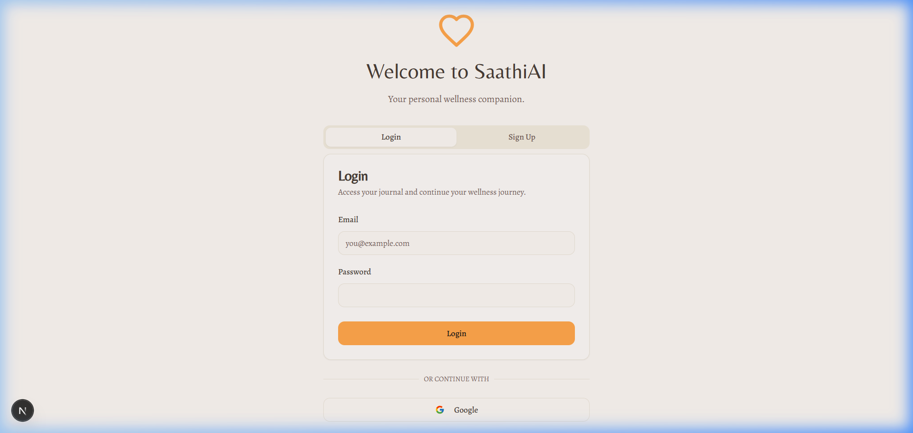
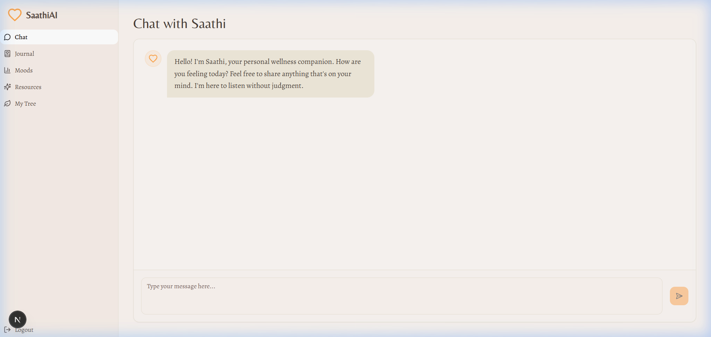
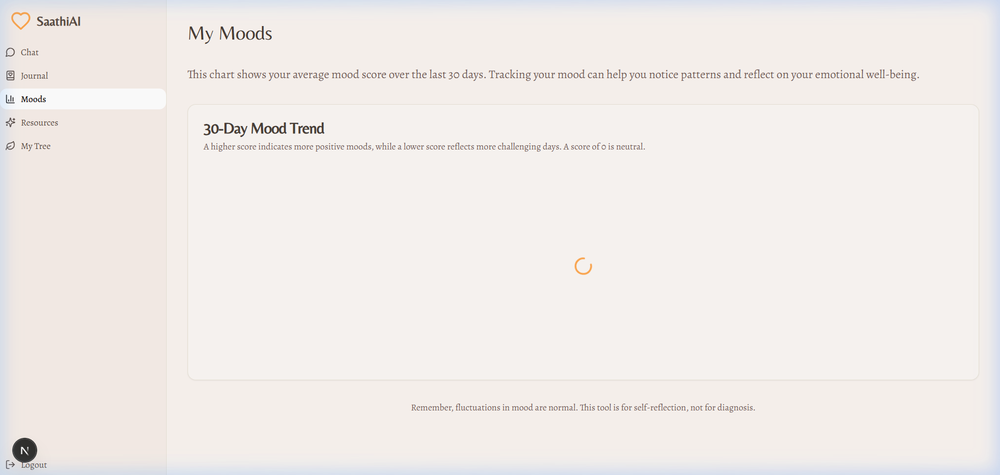
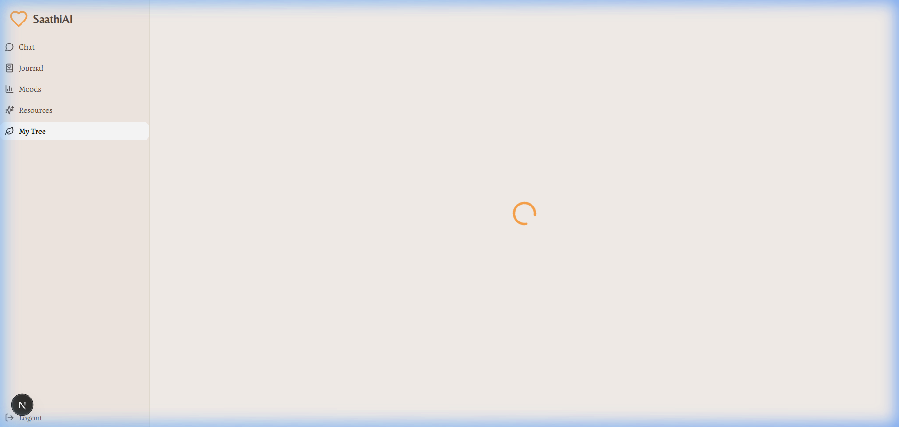

<p align="center">
  
  
  
  
  
</p>

<h1 align="center">🌿 SaathiAI Web</h1>
<p align="center"><b>Your Personal Wellness Companion</b></p>

<p align="center">
  A safe, supportive space for mental well-being. Track your mood, journal your thoughts, and chat with an empathetic AI companion.
</p>

<p align="center">
  <a href="https://saathi-ai-prototype-ccdi79ech-pagoluvijay7-3919s-projects.vercel.app" target="_blank"><strong>🚀 Live Demo</strong></a>
</p>

---

## ✨ Features

| Feature | Description |
|---------|-------------|
| 🤖 **Empathetic AI Chat** | Anonymous, supportive conversations powered by Google's Gemini AI. No judgment, just understanding. |
| 📝 **Private Journaling** | A secure space to write down your thoughts and feelings. Entries are encrypted and stored in Firestore. |
| 📊 **Mood Tracking** | Visualize your emotional trends over time with an interactive, responsive chart. |
| 🌳 **Resilience Tree** | A gamified growth feature — your personal tree flourishes as you engage with the app, symbolizing your journey. |
| 🔐 **Secure Authentication** | Firebase Auth with Email/Password and Google Sign-In. Your data, your control. |

---

## 📸 Screenshots

> *Add screenshots of your app here to showcase the UI.*

| Landing Page | AI Chat | Mood Tracker | Resilience Tree |
|:------------:|:-------:|:------------:|:---------------:|
|  |  |  |  |

---

## 🛠 Tech Stack

- **Framework:** [Next.js 15](https://nextjs.org/) (App Router)
- **Language:** TypeScript
- **Styling:** Tailwind CSS
- **Backend & Auth:** Firebase Authentication, Cloud Firestore
- **AI:** Google Gemini API
- **Charts:** Recharts
- **Deployment:** [Vercel](https://vercel.com)

---

## 🚀 Getting Started

### Prerequisites

- [Node.js](https://nodejs.org/) v18 or later
- [npm](https://www.npmjs.com/) or [yarn](https://yarnpkg.com/)
- A [Firebase](https://firebase.google.com/) project
- A [Google AI Studio API Key](https://aistudio.google.com/app/apikey)

### 1. Clone the Repository

```bash
git clone <repository-url>
cd saathi-ai-web
```

### 2. Install Dependencies

```bash
npm install
# or
yarn install
```

### 3. Configure Environment Variables

Create a `.env.local` file in the project root:

```env
# Google Gemini API Key
GEMINI_API_KEY=your_gemini_api_key_here

# Firebase Configuration
NEXT_PUBLIC_FIREBASE_API_KEY=your_firebase_api_key
NEXT_PUBLIC_FIREBASE_AUTH_DOMAIN=your_project.firebaseapp.com
NEXT_PUBLIC_FIREBASE_PROJECT_ID=your_project_id
NEXT_PUBLIC_FIREBASE_STORAGE_BUCKET=your_project.appspot.com
NEXT_PUBLIC_FIREBASE_MESSAGING_SENDER_ID=your_sender_id
NEXT_PUBLIC_FIREBASE_APP_ID=your_app_id
```

> [!WARNING]
> **Security Note:** Never commit your `.env.local` file. It is already added to `.gitignore`.

### 4. Set Up Firebase

1. Go to the [Firebase Console](https://console.firebase.google.com/).
2. Create a new project (or use the existing project ID `saathiai-web`).
3. **Enable Authentication:**
   - Navigate to **Authentication** → **Sign-in method**
   - Enable **Email/Password** and **Google** providers
4. **Enable Firestore:**
   - Navigate to **Firestore Database** → **Create database**
   - Start in **test mode** for development (update security rules before production)

### 5. Run the Development Server

```bash
npm run dev
# or
yarn dev
```

Open [http://localhost:3000](http://localhost:3000) in your browser.

---

## 📁 Project Structure

```text
saathi-ai-web/
├── app/                    # Next.js App Router
│   ├── (routes)/           # Route groups
│   ├── api/                # API routes (Gemini integration)
│   ├── layout.tsx          # Root layout
│   └── page.tsx            # Landing page
├── components/             # Reusable React components
│   ├── chat/               # AI Chat components
│   ├── journal/            # Journaling components
│   ├── mood/               # Mood tracking components
│   └── tree/               # Resilience Tree components
├── lib/                    # Utility functions & Firebase config
├── hooks/                  # Custom React hooks
├── types/                  # TypeScript type definitions
└── public/                 # Static assets
```

---

## 🌐 API Endpoints

| Method | Endpoint | Description |
|:---|:---|:---|
| **POST** | `/api/chat` | Send a message to the Gemini AI assistant |
| **GET** | `/api/journal` | Fetch user's journal entries |
| **POST** | `/api/journal` | Create a new journal entry |
| **GET** | `/api/mood` | Fetch mood history data |

---

## 🚢 Deployment

### Deploy to Vercel (Recommended)

The easiest way to deploy is via Vercel:

1. Push your code to GitHub.
2. Import the repository on [Vercel](https://vercel.com/new).
3. Add your environment variables in the Vercel dashboard:
   - `GEMINI_API_KEY`
   - `NEXT_PUBLIC_FIREBASE_API_KEY`
   - `NEXT_PUBLIC_FIREBASE_AUTH_DOMAIN`
   - `NEXT_PUBLIC_FIREBASE_PROJECT_ID`
   - `NEXT_PUBLIC_FIREBASE_STORAGE_BUCKET`
   - `NEXT_PUBLIC_FIREBASE_MESSAGING_SENDER_ID`
   - `NEXT_PUBLIC_FIREBASE_APP_ID`
4. Deploy!

🔗 **Live Demo:** [saathi-ai-prototype-ccdi79ech-pagoluvijay7-3919s-projects.vercel.app](https://saathi-ai-prototype-ccdi79ech-pagoluvijay7-3919s-projects.vercel.app)

### Deploy to Firebase Hosting

```bash
npm install -g firebase-tools
firebase login
firebase init hosting
npm run build
firebase deploy
```

---
## 🔒 Security & Privacy

- All user data is stored securely in Firebase Firestore.
- Authentication is handled by Firebase Auth with industry-standard encryption.
- Journal entries are private and accessible only to the authenticated user.
- The app does not store or share chat conversations with third parties.

---

## 🤝 Contributing

Contributions are welcome! Please follow these steps:

1. Fork the repository
2. Create your feature branch (`git checkout -b feature/amazing-feature`)
3. Commit your changes (`git commit -m 'Add amazing feature'`)
4. Push to the branch (`git push origin feature/amazing-feature`)
5. Open a Pull Request

---

## 📄 License

This project is licensed under the MIT License — see the [LICENSE](LICENSE) file for details.

---

## 🙏 Acknowledgments

- Built with care for mental wellness
- Powered by Google Gemini AI
- Hosted on Firebase & Vercel

---

> [!IMPORTANT]
> **Disclaimer:** SaathiAI is a wellness tool and does not replace professional mental health care. If you are in crisis, please contact a licensed professional or emergency services.
